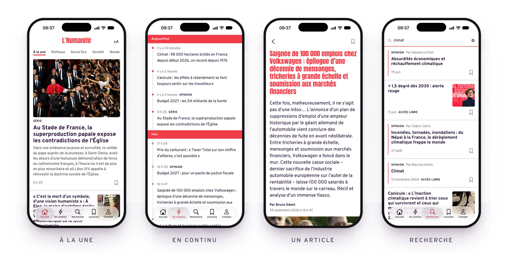
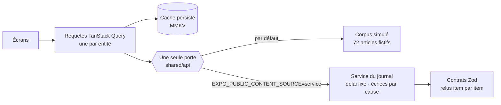

<div align="center">

<picture>
  <source media="(prefers-color-scheme: dark)" srcset="docs/showcase/banner-dark.webp">
  
</picture>


</div>

---

L'app officielle de _L'Humanité_ est une coquille hybride posée sur un service JSON. Ce dépôt la reconstruit
**entièrement en natif** — Expo SDK 57, React Native 0.86 en New Architecture, Hermes, React Compiler — sur le même
service, lu autrement : chaque réponse relue par des schémas avant d'atteindre l'écran, chaque attente habillée de ce que
l'app sait déjà, et chaque règle du dépôt écrite dans une décision puis prouvée par un test qui la casse.

Ce n'est pas seulement une app. C'est une manière de la construire : **un dépôt qui se défend tout seul.**

> Client non officiel du service du journal ([ADR-0027](docs/adr/0027-client-non-officiel-de-l-api-l-humanite.md)),
> en développement, non publié.

## Cinq refus

- **Aucun écran vide, aucune fausse réponse.** Un article s'ouvre sur ce que sa carte savait déjà ; une recherche dresse
  la forme de sa réponse pendant que le journal cherche, puis ne montre que la sienne.
- **Aucune règle orale.** Une décision structurante est un ADR ; chacune de ses règles, une preuve qui s'exécute ou une
  convention écrite.
- **Aucune exception.** Pas une règle de lint désactivée, pas un avertissement toléré.
- **Aucun secret dans un fichier suivi.** Une capture réseau n'entre dans le dépôt qu'après qu'un outil y a cherché les
  secrets — et il refuse d'écrire s'il en trouve un.
- **Aucun chiffre de complaisance.** Un budget de performance ne se mesure ni sur un émulateur, ni sur un paquet de
  debug.

## En chiffres

Relevé le 25/09/2026 sur `main`.

|                   |                                                                                                |
| ----------------- | ---------------------------------------------------------------------------------------------- |
| **36** ADR        | 32 en vigueur, 4 remplacés, 141 règles                                                         |
| **633** preuves   | exécutables, qui tiennent 107 de ces règles ; les 34 autres tiennent par une convention écrite |
| **1 885** tests   | 1 348 pour l'outillage (Vitest), 537 pour l'app (jest-expo et React Native Testing Library)    |
| **12** étapes     | `pnpm verify` en 2 minutes ; le pre-commit rejoue sur l'index celles que le commit concerne    |
| **0**             | désactivation de lint                                                                          |
| **68 000** lignes | de TypeScript : 18 000 pour l'app, 32 000 pour l'outillage qui la tient                        |

## Ce que le lecteur tient en main

<picture>
  <source media="(prefers-color-scheme: dark)" srcset="docs/showcase/screens-dark.webp">
  
</picture>

_Simulateur iPhone, service du journal, le 25/09/2026._

| Écran                       | Ce qu'il fait                                                                                                                     |
| --------------------------- | --------------------------------------------------------------------------------------------------------------------------------- |
| **À la une**                | la une et ses rubriques, qu'on fait tourner sous le doigt                                                                         |
| **En continu**              | tout le journal dans l'ordre où il est tombé, jour après jour ; ce qui a paru depuis votre dernier passage porte une perle pleine |
| **Recherche**               | la réponse du journal, page après page ; tant qu'il cherche, la forme de ses cartes, et sous le champ un trait qui court          |
| **Article**                 | la tête s'affiche avec ce que la carte savait déjà — titre, chapô, signature, heure — pendant que le corps arrive                 |
| **Lectures**                | les articles mis de côté, gardés sur le téléphone                                                                                 |
| **Kiosque**                 | les numéros du journal                                                                                                            |
| **Compte**                  | la connexion de l'abonné, dont le jeton dort dans le trousseau du téléphone                                                       |
| **Préférences d'affichage** | clair, sombre ou comme le système ; une taille de texte qui suit les tables d'iOS et la courbe d'Android, sans relancer           |

Les listes déjà lues sont écrites sur le disque et relues au démarrage : elles sont là avant la première requête
([ADR-0015](docs/adr/0015-cache-de-donnees-tanstack-query-persiste.md)). Et chaque texte de l'interface, jusqu'aux
annonces de VoiceOver, sort d'un dictionnaire français typé et composé à la française
([ADR-0013](docs/adr/0013-textes-ui-en-dictionnaire-francais-type.md)).

## Le lecteur ne regarde jamais le journal se charger

C'est la décision qui donne son caractère à l'app
([ADR-0035](docs/adr/0035-le-lecteur-ne-regarde-jamais-le-journal-se-charger.md)). Mesuré le 24/09/2026 contre le
service : la recherche du journal répond en 1 552 à 1 923 ms et ne se sert jamais d'un cache, et l'ouverture de l'app
prend 1 203 à 1 765 ms pour un budget de 1 500. Aucune app ne rend ce service plus rapide ; elle peut, en revanche,
ne jamais laisser le lecteur face au vide :

- **Montrer ce que l'app sait déjà, et seulement ce qui est vrai.** Un article s'ouvre sur la tête que sa carte portait
  déjà, lisible 200 ms après le doigt. Une recherche, elle, ne montre que la réponse du journal : les articles déjà lus
  qu'elle dressait à sa place — 27 à 48 sur « climat », remplacés une à deux secondes plus tard par dix autres — se
  lisaient comme la réponse.
- **Le nommer comme tel.** Un segment rouge court sur le trait sous le champ tant que le journal cherche, et VoiceOver
  entend « Le journal cherche … ».
- **Partir quand le doigt se pose.** La lecture d'un article est demandée dès que le doigt touche la carte, et court
  pendant l'animation de l'écran au lieu de s'y ajouter.
- **Des silhouettes qui respirent**, là où l'app ne sait rien et tant qu'une question attend sa réponse, dessinées dans
  un gris que les tokens tiennent visible à 10,4 pas de clarté de la page.
- **Une ouverture immobile un quart de seconde au moins**, le nom du journal posé sur le champ que le téléphone peignait
  déjà.

## Un dépôt qui se défend tout seul

Chaque décision structurante est un [ADR](docs/adr/README.md) au format MADR : faits sourcés, critères numérotés,
options étudiées, coût nommé, déclencheur de réévaluation. Une fois décidé, il est figé ; ses règles sont liées à des
preuves que l'outillage exécute à chaque commit
([ADR-0000](docs/adr/0000-decisions-structurantes-en-adr-madr-verifies-et-figes.md)).


- **Un garde-fou n'existe que s'il est prouvé** : une fixture qui casse une seule chose et doit produire exactement ses
  codes, ni plus ni moins
  ([ADR-0008](docs/adr/0008-controles-locaux-par-hooks-git-et-garde-fous-testes.md)).
- **Un commit cite ses décisions** : un trailer `Refs: ADR-NNNN` pour chaque ADR accepté dont le périmètre couvre un
  chemin touché, calculé et exigé par le hook.
- **Le lint ne transige pas** : chaque fichier suivi, sans cache, sans désactivation en ligne, sans avertissement
  ([ADR-0004](docs/adr/0004-lint-et-format-bloquants-sans-desactivation.md)).
- **Les agents travaillent sous une garde** : vingt et une règles, et un appel refusé nomme par son code chaque règle
  qu'il enfreint — pas de décision d'ADR, pas de contournement des hooks, pas d'écriture directe dans `.git`
  ([ADR-0009](docs/adr/0009-permissions-des-agents.md), [AGENTS.md](AGENTS.md)).

## Architecture



- **Une seule porte vers le contenu**, deux sources derrière : un corpus fictif aux visuels générés, ou le service du
  journal. Une build de service n'embarque pas le corpus
  ([ADR-0021](docs/adr/0021-acces-au-contenu-par-une-seule-porte-et-requetes-par-entite.md),
  [ADR-0029](docs/adr/0029-une-build-de-service-sans-le-corpus-par-variantes.md)).
- **Rien du service n'est cru sur parole.** Chaque réponse est relue item par item par les contrats : ce qu'ils
  refusent coûte l'item, nommé, et non la liste. Un corps d'article arrive en HTML WordPress de 45 à 76 ko, scripts et
  formulaire de don compris ; il est relu en blocs typés avant de toucher une primitive. Une image est demandée à la
  largeur de la place qu'elle remplit.
- **Un client borné et honnête** : chaque requête rend la main passé un délai fixe, chaque échec porte sa cause —
  réseau, délai, statut, réponse illisible
  ([ADR-0033](docs/adr/0033-un-client-borne-honnete-et-porteur-du-jeton-de-l-abonne.md)).
- **Feature-Sliced Design** vérifié par Steiger, graphe d'imports acyclique, routes hors de `src`
  ([ADR-0005](docs/adr/0005-architecture-fsd-avec-routes-hors-src-et-couche-app.md)) ; composants en cinq niveaux, dont
  seul le premier touche React Native et les bibliothèques natives
  ([ADR-0006](docs/adr/0006-niveaux-de-composants-l0-a-l4.md)).
- **Aucune valeur de style brute** : un nombre ou une couleur écrits à la main ne compilent pas, seuls passent les
  tokens brandés ([ADR-0012](docs/adr/0012-design-tokens-et-createstyles-brande.md)).

```text
apps/mobile/app/          routes Expo Router : chacune réexporte sa page et un ErrorBoundary
apps/mobile/src/
├── _app/                 racine : polices, ouverture, cache persisté, onglets natifs
├── pages/                un écran chacune
├── features/             ce que fait le lecteur : mettre de côté, se connecter, régler l'affichage, retrouver sa dernière visite
├── entities/article/     l'article : ses requêtes, son modèle, ses vues
└── shared/
    ├── api/              la seule porte vers le contenu
    ├── i18n/             le dictionnaire français typé
    ├── lib/              formats, stockage et trousseau, routage, annonces
    └── ui/               primitives, seules à toucher React Native, puis composants

packages/
├── contracts/            les schémas Zod de chaque donnée
├── design-tokens/        palette, rôles du thème, espacements, polices
├── architecture/         les places de l'architecture, et où chaque module s'importe
├── remote-api/           le client du service du journal
├── mock-api/             la même porte, sur le corpus simulé
├── mock-content/         le corpus fictif et ses visuels générés
├── unknown/              le seul endroit qui lit une valeur inconnue
└── eslint-config/, tsconfig/

tools/                    adr, governance, git-hooks, guardrails, agents, lint, structure, deps,
                          expo, perf, capture, emulator, fixtures, kit
docs/adr/                 les décisions
docs/app-actuelle/        l'app officielle 6.2.0, en 20 captures annotées
```

| Couche     | Choix                                                                                                |
| ---------- | ---------------------------------------------------------------------------------------------------- |
| Plateforme | Expo 57.0.25, React Native 0.86.3 (New Architecture, Hermes), React 19.2.3 et React Compiler         |
| Navigation | Expo Router 57.0.23, onglets natifs                                                                  |
| Données    | TanStack Query 5.103.2 persisté dans MMKV 4.3.2, contrats Zod 4.6.5, Zustand 5.0.15                  |
| Rendu      | FlashList 2.0.2, Reanimated 4.5.1, expo-image, symboles natifs                                       |
| Langage    | TypeScript 6.0.3 ultra-strict, en une seule version                                                  |
| Qualité    | ESLint 10.11.0, Prettier 3.9.9, Steiger 0.6.0, Knip                                                  |
| Tests      | jest-expo 57.0.5 et RNTL 14.0.1 pour l'app, Vitest 5.0.1 pour l'outillage, Maestro pour les parcours |
| Outillage  | Node 24.21.0, pnpm 11.27.1, catalog strict                                                           |

## Démarrer

```bash
pnpm install          # pnpm 11.27.1 ; Node 24.21.0, que pnpm télécharge au besoin
pnpm hooks:install    # les hooks git du dépôt
pnpm verify           # tous les contrôles, dans l'ordre
```

**L'app.** Sans source nommée, une build lit le corpus simulé. Pour le vrai journal, `EXPO_PUBLIC_CONTENT_SOURCE=service`
et l'identité que l'app présente au service, fournie au build par les variables `EXPO_PUBLIC_APP_SECRET` et
`EXPO_PUBLIC_DEVICE_*` — jamais par un fichier suivi.

- **iOS** : depuis `apps/mobile`, `pnpm exec expo run:ios` construit le dev client et l'ouvre dans le simulateur ;
  `pnpm exec expo start --dev-client` sert ensuite l'app.
- **Android** : `pnpm emulator:up`, `pnpm emulator:build`, `pnpm emulator:install`, puis `pnpm emulator:metro` ;
  `pnpm emulator:e2e` joue les parcours Maestro
  ([ADR-0010](docs/adr/0010-emulateur-android-redroid-sur-le-serveur.md)).
- **Le catalogue** : un écran de l'app présente chaque primitive et chaque composant catalogués, rangés par niveau.

> [!WARNING]
> Ne lancez jamais Metro avec `CI=1` : son watcher s'éteint, et le dev client sert en silence le dernier bundle valide.

Les commandes du dépôt, chacune avec son rôle, sont dans [AGENTS.md](AGENTS.md).

## Mesurer, pas supposer

- **Deux budgets, lus sur ce qu'Android répond de l'app**, jamais sur ce que l'app dit d'elle-même
  ([ADR-0025](docs/adr/0025-budgets-de-performance-et-outils-de-mesure.md)) : le lancement à froid jusqu'à la première
  image, 1 500 ms au plus ; les images du fil rendues hors de leur échéance, 1 % au plus. `pnpm perf:check` juge une
  session de relevés contre eux.
- **L'accessibilité se déclare** : chaque image dit ce qu'elle annonce à un lecteur d'écran, chaque titre qui ouvre une
  section se déclare comme tel, et le contraste exigé d'une couleur se déduit de la plus petite composition où le journal
  la pose ([ADR-0026](docs/adr/0026-accessibilite-annoncee-et-contraste-deduit-de-la-taille.md)).
- **Une interface se filme** : un correctif d'écran est filmé au simulateur et mesuré image par image avant d'être dit
  réparé. Le trait de la recherche l'a été sur huit attentes, chacune partie du début du trait et menée jusqu'au bout.
- **L'émulateur rend l'hôte intact** : Android tourne dans un conteneur Redroid épinglé par digest, et `pnpm emulator:down`
  laisse la machine identique à ce qu'elle était.

## Le cap

L'app n'est pas publiée. Elle le sera sans dette — chaque décision écrite, chaque règle prouvée. D'ici là :

- [ ] **Une clé à elle.** La connexion de l'abonné passe aujourd'hui sous une clé prêtée, pour les tests
      ([ADR-0032](docs/adr/0032-la-connexion-de-l-abonne-sous-une-cle-pretee.md)) : rien ne sort avant qu'une clé
      dédiée la remplace.
- [ ] **Tout le service de l'abonné.** Les routes `store/*` et `drm/*`, qui portent le jeton de l'abonné, restent à
      lire ; le kiosque, qui ouvre aujourd'hui chaque numéro sur humanite.fr, pourrait alors les ouvrir dans l'app.
- [ ] **Des budgets tenus sur de vrais téléphones**, en build de production, relevés dans le journal de la session qui
      les a pris.
- [ ] **Expo SDK 58**, qui emportera le plugin de scène écrit pour iOS 27.

## Droits

Les articles et les images que sert le service appartiennent à _L'Humanité_ et à leurs auteurs. Le corpus simulé est
fictif, et chacun de ses visuels découle de sa seule clé et de la couleur de sa rubrique.
