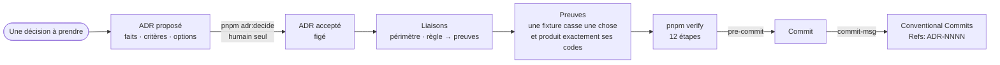
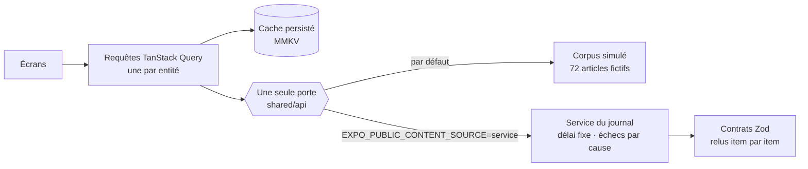

<div align="center">

<picture>
  <source media="(prefers-color-scheme: dark)" srcset="docs/showcase/banner-dark.webp">
  
</picture>

[](https://github.com/alexandre-vl/humanite-app/actions/workflows/ci.yml)
[](https://github.com/alexandre-vl/humanite-app/releases/latest)
[](LICENSE)


**Client non officiel**, sans lien avec _L'Humanité_ ni approbation du journal.

</div>

---

> Ce projet indépendant n'est ni affilié à _L'Humanité_ ni approuvé par elle
> ([ADR-0027](docs/adr/0027-client-non-officiel-de-l-api-l-humanite.md)). Les articles, les images et la marque
> appartiennent au journal et à leurs auteurs. Ses versions sortent en
> [releases](https://github.com/alexandre-vl/humanite-app/releases), hors de tout store.

_L'Humanité_ est un quotidien fondé par Jean Jaurès en 1904. Son app officielle est une coquille hybride posée sur un
service JSON. Ce dépôt en écrit un client natif sur le même service — Expo SDK 57, React Native 0.86 en New
Architecture, Hermes, React Compiler.

Deux choses le distinguent d'un portage : rien de ce que renvoie le service n'atteint l'écran sans avoir été relu par
un schéma, et aucune règle du dépôt n'existe sans une décision écrite et un test qui la tient.

## Les écrans

<picture>
  <source media="(prefers-color-scheme: dark)" srcset="docs/showcase/screens-dark.webp">
  
</picture>

_Simulateur iPhone, service du journal, le 26/09/2026._

| Écran                       | Ce qu'il fait                                                                                                               |
| --------------------------- | --------------------------------------------------------------------------------------------------------------------------- |
| **À la une**                | la une et ses rubriques, qu'on fait tourner sous le doigt                                                                   |
| **En continu**              | le journal dans l'ordre de publication, sous la date de chaque jour ; ce qui a paru depuis votre dernier passage est marqué |
| **Recherche**               | les résultats du journal, page après page ; pendant la recherche, la forme des cartes et un indicateur sous le champ        |
| **Article**                 | la tête s'affiche avec ce que la carte savait déjà — titre, chapô, signature, heure — pendant que le corps arrive           |
| **Lectures**                | les articles mis de côté, gardés sur le téléphone                                                                           |
| **Kiosque**                 | les numéros du journal                                                                                                      |
| **Compte**                  | la connexion de l'abonné ; son jeton est gardé dans le trousseau du téléphone                                               |
| **Préférences d'affichage** | clair, sombre ou comme le système ; une taille de texte qui suit les tables d'iOS et la courbe d'Android, sans relancer     |

Les listes déjà lues sont écrites sur le disque et relues au démarrage : elles sont là avant la première requête
([ADR-0015](docs/adr/0015-cache-de-donnees-tanstack-query-persiste.md)). Chaque texte de l'interface, jusqu'aux
annonces de VoiceOver, sort d'un dictionnaire français typé et composé à la française
([ADR-0013](docs/adr/0013-textes-ui-en-dictionnaire-francais-type.md)).

## Pendant que le journal répond

Mesuré le 24/09/2026 contre le service : une recherche répond en 1 552 à 1 923 ms et ne se sert jamais d'un cache ;
l'ouverture de l'app prend 1 203 à 1 765 ms, pour un budget de 1 500. Aucune app ne rendra ce service plus rapide.
Elle peut, en revanche, ne pas transformer cette attente en écran vide
([ADR-0037](docs/adr/0037-le-lecteur-n-attend-devant-rien-de-vide-ni-de-faux.md)).

- **Un article s'ouvre sur ce que sa carte portait déjà** — titre, chapô, signature, heure — lisible 200 ms après le
  doigt, pendant que le corps arrive.
- **Une recherche ne montre que les résultats du journal.** Les articles déjà en cache qu'elle dressait en attendant
  — 27 à 48 sur « climat », remplacés une à deux secondes plus tard par dix autres — se lisaient comme la réponse.
- **L'attente est nommée** : un segment rouge court sous le champ tant que le journal cherche, et VoiceOver annonce
  « Le journal cherche … ».
- **La lecture part au contact du doigt**, pas à l'ouverture de l'écran : elle court pendant l'animation au lieu de
  s'y ajouter.
- **Des silhouettes** là où l'app ne sait rien, dans un gris que les tokens tiennent à 10,4 pas de clarté de la page.

## Le dépôt

Chaque décision structurante est un [ADR](docs/adr/README.md) au format MADR : faits sourcés, critères numérotés,
options étudiées, coût nommé, déclencheur de réévaluation. Une fois décidé, il est figé ; ses règles sont liées à des
preuves que l'outillage exécute à chaque commit
([ADR-0000](docs/adr/0000-decisions-structurantes-en-adr-madr-verifies-et-figes.md)).



- **Un garde-fou n'existe que s'il est prouvé** : une fixture qui casse une seule chose et doit produire exactement ses
  codes, ni plus ni moins ([ADR-0008](docs/adr/0008-controles-locaux-par-hooks-git-et-garde-fous-testes.md)).
- **Un commit cite ses décisions** : un trailer `Refs: ADR-NNNN` par ADR accepté dont le périmètre couvre un chemin
  touché, calculé et exigé par le hook.
- **Le lint ne transige pas** : chaque fichier suivi, sans cache, sans désactivation en ligne, sans avertissement
  ([ADR-0004](docs/adr/0004-lint-et-format-bloquants-sans-desactivation.md)).
- **Aucun secret dans un fichier suivi** : une capture réseau n'entre qu'après qu'un outil y a cherché les secrets, et
  il refuse d'écrire s'il en trouve un.
- **Les agents travaillent sous une garde** : vingt et une règles, et un appel refusé nomme par son code chaque règle
  qu'il enfreint — pas de décision d'ADR, pas de contournement des hooks, pas d'écriture directe dans `.git`
  ([ADR-0009](docs/adr/0009-permissions-des-agents.md), [AGENTS.md](AGENTS.md)).
- **Le serveur rejoue tout** : chaque push et chaque pull request repassent `pnpm verify` sur un clone complet,
  cherchent un secret dans tout l'historique et construisent l'app pour Android et iOS ([CI](.github/workflows/ci.yml)).
  `main` refuse la réécriture et la suppression ; une pull request n'y est fusionnée que verte, par rebase. Une version
  sort d'un tag posé sur un commit vert : APK signé, sommes SHA-256, attestation de provenance
  ([Release](.github/workflows/release.yml)).

Relevé le 26/09/2026 sur `main` :

|                   |                                                                                                      |
| ----------------- | ---------------------------------------------------------------------------------------------------- |
| **40** ADR        | 33 acceptés, 5 remplacés, 2 proposés ; 162 règles                                                    |
| **650** preuves   | exécutables, qui tiennent 117 de ces règles ; les 45 autres tiennent par une convention écrite       |
| **1 931** tests   | 1 380 pour l'outillage (Vitest), 551 pour l'app (jest-expo et React Native Testing Library)          |
| **12** étapes     | `pnpm verify` en deux minutes ; le pre-commit rejoue sur l'index celles que le commit concerne       |
| **0**             | désactivation de lint                                                                                |
| **62 500** lignes | de TypeScript hors code généré : 19 000 pour l'app, 33 000 pour l'outillage, 10 000 pour les paquets |

## Architecture



- **Une seule porte vers le contenu**, deux sources derrière : un corpus fictif aux visuels générés, ou le service du
  journal. Une build de service n'embarque pas le corpus
  ([ADR-0021](docs/adr/0021-acces-au-contenu-par-une-seule-porte-et-requetes-par-entite.md),
  [ADR-0029](docs/adr/0029-une-build-de-service-sans-le-corpus-par-variantes.md)).
- **Rien du service n'est cru sur parole.** Chaque réponse est relue item par item : ce que les contrats refusent coûte
  l'item, nommé, et non la liste. Un corps d'article arrive en HTML WordPress de 45 à 76 ko, scripts et formulaire de
  don compris ; il est relu en blocs typés avant de toucher une primitive. Une image est demandée à la largeur de la
  place qu'elle remplit.
- **Un client borné** : chaque requête rend la main passé un délai fixe, chaque échec porte sa cause — réseau, délai,
  statut, réponse illisible ([ADR-0033](docs/adr/0033-un-client-borne-honnete-et-porteur-du-jeton-de-l-abonne.md)).
- **Feature-Sliced Design** vérifié par Steiger, graphe d'imports acyclique, routes hors de `src`
  ([ADR-0005](docs/adr/0005-architecture-fsd-avec-routes-hors-src-et-couche-app.md)) ; composants en cinq niveaux, dont
  seul le premier touche React Native et les bibliothèques natives
  ([ADR-0006](docs/adr/0006-niveaux-de-composants-l0-a-l4.md)).
- **Aucune valeur de style brute** : un nombre ou une couleur écrits à la main ne compilent pas, seuls passent les
  tokens brandés ([ADR-0012](docs/adr/0012-design-tokens-et-createstyles-brande.md)).

```text
apps/mobile/app/          routes Expo Router : chacune réexporte sa page et un ErrorBoundary
apps/mobile/src/
├── _app/                 racine : polices, ouverture, cache persisté, onglets natifs
├── pages/                un écran chacune
├── features/             ce que fait le lecteur : mettre de côté, se connecter, régler l'affichage, retrouver sa dernière visite
├── entities/article/     l'article : ses requêtes, son modèle, ses vues
└── shared/
    ├── api/              la seule porte vers le contenu
    ├── i18n/             le dictionnaire français typé
    ├── lib/              formats, stockage et trousseau, routage, annonces
    └── ui/               primitives, seules à toucher React Native, puis composants

packages/
├── contracts/            les schémas Zod de chaque donnée
├── design-tokens/        palette, rôles du thème, espacements, polices
├── architecture/         les places de l'architecture, et où chaque module s'importe
├── remote-api/           le client du service du journal
├── mock-api/             la même porte, sur le corpus simulé
├── mock-content/         le corpus fictif et ses visuels générés
├── unknown/              le seul endroit qui lit une valeur inconnue
└── eslint-config/, tsconfig/

tools/                    adr, governance, git-hooks, guardrails, agents, lint, structure, deps,
                          expo, perf, capture, emulator, fixtures, kit
docs/adr/                 les décisions
docs/app-actuelle/        l'app officielle 6.2.0, en 20 captures annotées
```

| Couche     | Choix                                                                                                |
| ---------- | ---------------------------------------------------------------------------------------------------- |
| Plateforme | Expo 57.0.25, React Native 0.86.3 (New Architecture, Hermes), React 19.2.3 et React Compiler         |
| Navigation | Expo Router 57.0.23, onglets natifs                                                                  |
| Données    | TanStack Query 5.103.2 persisté dans MMKV 4.3.2, contrats Zod 4.6.5, Zustand 5.0.15                  |
| Rendu      | FlashList 2.0.2, Reanimated 4.5.1, expo-image, symboles natifs                                       |
| Langage    | TypeScript 6.0.3 ultra-strict, en une seule version                                                  |
| Qualité    | ESLint 10.11.0, Prettier 3.9.9, Steiger 0.6.0, Knip                                                  |
| Tests      | jest-expo 57.0.5 et RNTL 14.0.1 pour l'app, Vitest 5.0.1 pour l'outillage, Maestro pour les parcours |
| Outillage  | Node 24.21.0, pnpm 11.27.1, catalog strict                                                           |

## Démarrer

**Sans rien construire** : la [dernière release](https://github.com/alexandre-vl/humanite-app/releases/latest) porte un
APK Android signé et l'app pour le simulateur iOS. Elles lisent le service du journal ; un abonné peut y entrer ses
identifiants, qui vont au journal et ne sont jamais gardés par l'app.

```bash
pnpm install          # pnpm 11.27.1 ; Node 24.21.0, que pnpm télécharge au besoin
pnpm hooks:install    # les hooks git du dépôt
pnpm verify           # tous les contrôles, dans l'ordre
```

**L'app.** Sans source nommée, une build lit le corpus simulé ; `EXPO_PUBLIC_CONTENT_SOURCE=service` la met sur le
service du journal. Rien d'autre n'est à fournir : l'identité que l'app présente au service est une clé publique de
client, portée par le code, et chaque installation frappe sa propre attestation d'appareil
([ADR-0040](docs/adr/0040-la-connexion-de-l-abonne-sous-la-cle-publique-du-client.md)).

- **iOS** : depuis `apps/mobile`, `pnpm exec expo run:ios` construit le dev client et l'ouvre dans le simulateur ;
  `pnpm exec expo start --dev-client` sert ensuite l'app.
- **Android** : `pnpm emulator:up`, `pnpm emulator:build`, `pnpm emulator:install`, puis `pnpm emulator:metro` ;
  `pnpm emulator:e2e` joue les parcours Maestro
  ([ADR-0010](docs/adr/0010-emulateur-android-redroid-sur-le-serveur.md)).
- **Le catalogue** : un écran de l'app présente chaque primitive et chaque composant catalogués, rangés par niveau.

> [!WARNING]
> Ne lancez jamais Metro avec `CI=1` : son watcher s'éteint, et le dev client sert en silence le dernier bundle valide.

Les commandes du dépôt, chacune avec son rôle, sont dans [AGENTS.md](AGENTS.md) ; pour proposer une modification :
[CONTRIBUTING.md](CONTRIBUTING.md).

## Mesures

- **Deux budgets, lus sur ce qu'Android répond de l'app**, jamais sur ce que l'app dit d'elle-même
  ([ADR-0025](docs/adr/0025-budgets-de-performance-et-outils-de-mesure.md)) : le lancement à froid jusqu'à la première
  image, 1 500 ms au plus ; les images du fil rendues hors de leur échéance, 1 % au plus. `pnpm perf:check` juge une
  session de relevés contre eux. Ni un émulateur ni une build de debug ne comptent.
- **L'accessibilité se déclare** : chaque image dit ce qu'elle annonce à un lecteur d'écran, chaque titre qui ouvre une
  section se déclare comme tel, et le contraste exigé d'une couleur se déduit de la plus petite composition où le
  journal la pose ([ADR-0026](docs/adr/0026-accessibilite-annoncee-et-contraste-deduit-de-la-taille.md)).
- **Un correctif d'écran est filmé** au simulateur et mesuré image par image avant d'être dit réparé. Le trait de la
  recherche l'a été sur huit attentes, chacune partie du début du trait et menée jusqu'au bout.
- **L'émulateur rend l'hôte intact** : Android tourne dans un conteneur Redroid épinglé par digest, et
  `pnpm emulator:down` laisse la machine identique à ce qu'elle était.

## À faire

- [ ] **Une clé de client à elle.** L'app se présente au service sous la clé publique du client officiel. Une clé
      dédiée, demandée à l'éditeur, la remplacerait
      ([ADR-0040](docs/adr/0040-la-connexion-de-l-abonne-sous-la-cle-publique-du-client.md)).
- [ ] **Le reste du service de l'abonné.** Les routes `store/*` et `drm/*` restent à lire ; le kiosque, qui ouvre
      aujourd'hui chaque numéro sur humanite.fr, pourrait alors les ouvrir dans l'app.
- [ ] **Des budgets tenus sur de vrais téléphones**, en build de production, relevés dans le journal de la session qui
      les a pris.
- [ ] **Expo SDK 58**, qui emportera le plugin de scène écrit pour iOS 27.

## Licence et droits

Le code et la documentation de ce dépôt sont publiés sous la
[PolyForm Noncommercial License 1.0.0](LICENSE) : libres pour tout usage non commercial — apprendre, tester, modifier,
partager ; un usage commercial demande l'accord de l'auteur.

Les articles et les images que sert le service appartiennent à _L'Humanité_ et à leurs auteurs, comme la marque du
journal : la licence du dépôt ne s'étend à aucun d'eux. Le corpus simulé est fictif, et chacun de ses visuels découle
de sa seule clé et de la couleur de sa rubrique.

Contribuer : [CONTRIBUTING.md](CONTRIBUTING.md) · signaler une faille : [SECURITY.md](SECURITY.md) · conduite :
[CODE_OF_CONDUCT.md](CODE_OF_CONDUCT.md).
