# App L'Humanité actuelle — captures annotées

Référence pour la refonte React Native. 20 captures Android (1080×2412) prises le 13/09/2026
(09:24:53 → 09:26:56, puis 10:04:35 → 10:04:49), app en version **6.2.0**.

> **Document descriptif, non normatif.** Les mesures (couleurs, typographie, dimensions) datent du 13/09/2026 et décrivent l'app actuelle. Les décisions de la refonte vivent dans les ADR (`docs/adr/`) ; les pistes « En RN » sont des idées à valider, pas des exigences. Noms de composants, palette et typographie de référence : ceux du code (design tokens, catalogue), pas ceux de ce document.

> ✗ problème qui casse l'expérience · ⚠ friction · ✓ à garder · **En RN** = piste pour la refonte

## Sommaire

| #   | Écran                                        | Heure    | Fichier d'origine                |
| --- | -------------------------------------------- | -------- | -------------------------------- |
| 01  | Splash                                       | 09:24:53 | `Screenshot_20260913-092453.png` |
| 02  | À la une                                     | 09:24:58 | `Screenshot_20260913-092458.png` |
| 03  | En continu                                   | 09:25:00 | `Screenshot_20260913-092500.png` |
| 04  | Kiosque                                      | 09:25:06 | `Screenshot_20260913-092506.png` |
| 05  | Mon compte                                   | 09:25:09 | `Screenshot_20260913-092509.png` |
| 06  | Favoris (vide)                               | 09:25:15 | `Screenshot_20260913-092515.png` |
| 07  | Recherche — saisie                           | 09:25:20 | `Screenshot_20260913-092520.png` |
| 08  | Recherche — chargement                       | 09:25:34 | `Screenshot_20260913-092534.png` |
| 09  | Recherche — résultats                        | 09:25:37 | `Screenshot_20260913-092537.png` |
| 10  | Préférences d'affichage                      | 09:25:46 | `Screenshot_20260913-092546.png` |
| 11  | Article vidéo — haut                         | 09:26:29 | `Screenshot_20260913-092629.png` |
| 12  | Article vidéo — bas                          | 09:26:34 | `Screenshot_20260913-092634.png` |
| 13  | Article texte — haut                         | 09:26:43 | `Screenshot_20260913-092643.png` |
| 14  | Article texte — corps                        | 09:26:46 | `Screenshot_20260913-092646.png` |
| 15  | Article texte — intertitre                   | 09:26:50 | `Screenshot_20260913-092650.png` |
| 16  | Article texte — fin                          | 09:26:56 | `Screenshot_20260913-092656.png` |
| 17  | Rubrique Monde — haut                        | 10:04:35 | `Screenshot_20260913-100435.png` |
| 18  | Rubrique Monde — cartes empilée et chronique | 10:04:39 | `Screenshot_20260913-100439.png` |
| 19  | Rubrique Monde — cartes ligne                | 10:04:42 | `Screenshot_20260913-100442.png` |
| 20  | Mon compte — déconnecté (connexion)          | 10:04:49 | `Screenshot_20260913-100449.png` |

## Carte de navigation

```text
01 Splash
└─ Barre du bas
   ├─ À LA UNE ─── onglets haut : À la une (02) │ Favoris (06) │ Recherche (07 → 08 → 09)
   │               + rubriques : Politique · Social Éco · Société · Monde (17 → 18 → 19)
   │                             · Culture et savoir · Féminism… (suite non capturée)
   ├─ EN CONTINU ─ onglets haut : En continu (03) │ Favoris
   ├─ KIOSQUE ──── Tous │ Mes publications (04)
   └─ MON COMPTE ─ déconnecté : connexion (20)
                   connecté : liste (05) ─┬─ Préférences d'affichage (10)
                                          ├─ Ma bibliothèque · Nous contacter · Politiques et CGU
                                          └─ Restaurer mes achats · Supprimer mon compte · Confidentialité · Déconnexion

Article — plein écran, retour ‹, sans barre du bas
   ├─ vidéo (fond sombre) : 11 → 12
   └─ texte (fond clair)  : 13 → 14 → 15 → 16
   (écran d'où les articles ont été ouverts : non capturé)
```

## Pourquoi c'est une webapp

| Indice                                                                                                 | Capture | Ce que ça montre                                                                                                         |
| ------------------------------------------------------------------------------------------------------ | ------- | ------------------------------------------------------------------------------------------------------------------------ |
| `Version du site : 3.87.0-2608241428 (css-custom 300) - Version de l'application : 6.2.0 (2025071511)` | 05      | l'interface est un **site** versionné à part du shell natif (lecture probable : site du 24/08/2026, shell du 15/07/2025) |
| « By IMMANENS » · « © Réalisé par Immanens »                                                           | 01, 05  | solution en marque blanche d'un prestataire                                                                              |
| slider bleu `#0075FF`, liste déroulante HTML, unité « 16px » affichée                                  | 10      | contrôles de formulaire du navigateur, hors charte                                                                       |
| spinner **et** skeleton en même temps                                                                  | 08      | deux mécanismes de chargement web superposés                                                                             |

Non vérifié : que `#0075FF` soit l'accent par défaut des contrôles Chromium, et la techno du shell
(WebView simple, Cordova, Capacitor…). Pour trancher, inspecter l'APK :

```bash
adb shell pm list packages | grep -i huma      # trouver le package
adb shell pm path <package>                    # chemin de l'APK
adb pull <chemin>/base.apk && unzip -l base.apk | grep -iE 'cordova|capacitor|assets/www'
```

## Design system mesuré

### Couleurs

| Rôle           | App (pixel) | humanite.fr (CSS)                              | Où                                                                              |
| -------------- | ----------- | ---------------------------------------------- | ------------------------------------------------------------------------------- |
| Rouge logo     | `#E30613`   | —                                              | logo (02)                                                                       |
| Rouge UI       | `#F13C47`   | `--c-red: #f13c47`                             | onglets haut, onglet actif, titres, liens, fond En continu (02, 03, 04, 13, 14) |
| Aubergine      | `#230434`   | `--c-purple: #280036`                          | titres de cartes, texte, onglets inactifs, bouton actif (02, 08, 14)            |
| Orange bouton  | `#F4AB3C`   | —                                              | TOUS, RECHERCHER (04, 07)                                                       |
| Jaune premium  | `#FFD603`   | `#ffd600` + « H » `#251435` (icône `gold-dot`) | badge H (02, 09)                                                                |
| Gris-bleu      | `#ECF2F2`   | —                                              | header, barre du bas, haut d'article, encarts (02, 13, 16)                      |
| Gris carte     | `#F5F5F5`   | —                                              | listes de Mon compte (05)                                                       |
| Fond sombre    | `#141414`   | `#141414`                                      | article vidéo (11)                                                              |
| Gris date      | `#918199`   | —                                              | dates des résultats (09)                                                        |
| Barres système | `#C84742`   | —                                              | status bar + barre de navigation : un **3e rouge**                              |
| Bleu slider    | `#0075FF`   | —                                              | préférences (10), hors charte                                                   |

### Typographie

| Usage                                                      | Police                       | Statut                                                                                                            |
| ---------------------------------------------------------- | ---------------------------- | ----------------------------------------------------------------------------------------------------------------- |
| Titres, onglets, rubriques, boutons (capitales condensées) | **Tanker**                   | vérifié : recouvrement 0,87 (`POLITIQUE`) et 0,67 (titre de 13), polices témoins ≤ 0,46 ; hauteurs ×1,00 et ×1,01 |
| Corps d'article                                            | **Roboto Light (300)**       | vérifié : score mot à mot 1,000 vs Overpass Light 0,943                                                           |
| Listes, champs                                             | Roboto Regular               | probable : 0,978 vs Overpass Light 0,974                                                                          |
| Chapô gras                                                 | Roboto Bold ou Overpass Bold | indiscernable : 0,999 vs 0,997                                                                                    |
| Logo                                                       | wordmark serif (image)       | —                                                                                                                 |

Le site humanite.fr déclare **Tanker** et **Overpass** (Light, Regular, Italic, Bold), plus Inter, dans
`wp-content/themes/humanite/dist/index.css`. L'app reprend Tanker mais affiche le texte courant en Roboto.

### Composants récurrents

- `Header` : logo centré sur `#ECF2F2`, retour ‹ dans les sous-pages (10–16)
- `TopTabs` : fond rouge, onglet actif souligné (02, 03, 06, 07)
- `RubriquesBar` : scroll horizontal, Tanker noir, rubrique active soulignée d'une barre rouge (02, 03, 17)
- `ArticleCard`, 8 variantes :
  - hero : image, titre dessous, chapô en option (02, 17)
  - hero : titre sur l'image (03)
  - texte seul + chapô (02)
  - empilée : titre → photo arrondie → chapô → date (18)
  - ligne : titre, puis vignette à gauche et chapô à droite, date en option (09, 19)
  - chronique : visuel rouge « CHRONIQUE » avec portrait du chroniqueur (09, 18)
  - item de timeline : heure · point · titre (03)
  - carte « Sur le même thème » inclinée (12, 15, 16)
- `FeedSection` : blocs alternés blanc / `#ECF2F2`, raccordés par de grands arrondis (18, 19)
- `PremiumBadge` : rond jaune « H » = article premium (classe `vertical-card__premium` sur humanite.fr) (02, 09)
- `BookmarkButton` : rond à pastille rouge, sur l'image ou sous le titre (02, 09, 12–14)
- `CoverCarousel` : couvertures par publication (04)
- `SettingsGroup` : liste groupée à chevrons (05, 20)
- `LoginCard` : création de compte, connexion, restauration d'achats (20)
- `Callout` : encart incliné, titre rouge + texte aubergine (16)
- `BottomTabBar` : 4 onglets, icônes au trait, libellés Tanker (02–10)

### À garder

- ✓ Identité forte : Tanker, rouge / aubergine / jaune, badge H.
- ✓ Cartes « papier » inclinées (12, 15, 16).
- ✓ Gabarit sombre des articles vidéo (11).
- ✓ Accessibilité : taille du texte et police pour dyslexiques (10).
- ✓ Timeline En continu (03) ; Kiosque à trois publications (04).

### Frictions transverses

- ✗ **Navigation empilée** : barre du bas + onglets haut + rubriques. Sur 02, le contenu tient entre y≈548 et y=2141 sur 2412 px, soit ≈ 66 % de la hauteur.
- ✗ **Chargements** : spinner au démarrage (01), spinner et skeleton simultanés (08).
- ✗ **Contrôles web** hors charte et libellés sans marge (10).
- ✗ **Connexion** : création de compte, connexion et restauration d'achats mêlées dans une seule carte (20).
- ⚠ **Trois rouges** : logo `#E30613`, UI `#F13C47`, barres système `#C84742`.
- ⚠ **États vides nus** : Favoris (06), Recherche avant saisie (07).
- ⚠ **Métadonnées pauvres** : cartes sans date ni rubrique (02, 19), couvertures sans date (04), auteur et date après le média (12, 14).
- ⚠ **Pas de partage** visible sur les 6 captures d'article (11–16).
- ⚠ **Incohérences** : « À LA UNE » toujours blanc dans les onglets haut (02, 06, 07) ; deux typos dans le filtre du Kiosque (04) ; 3 onglets haut sur À la une contre 2 sur En continu (02, 03) ; onglet « À LA UNE » et rubrique actifs en même temps (17).

---

## Écrans

### 01 · Splash

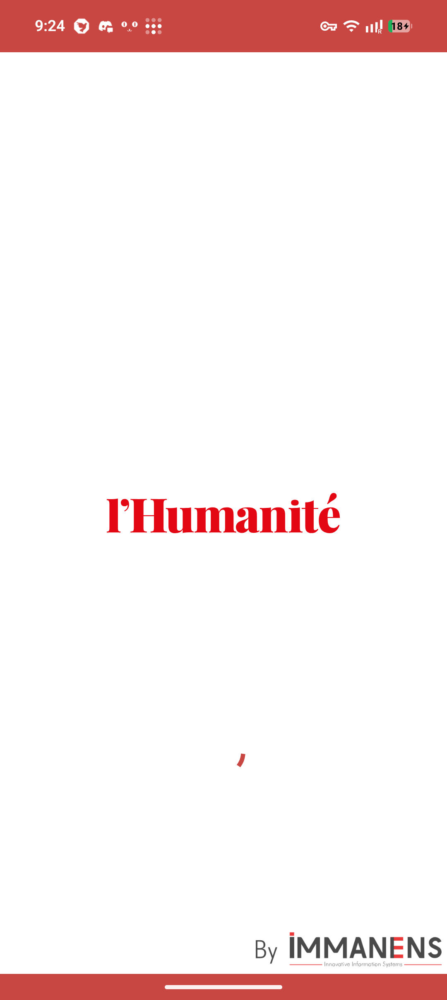

`Screenshot_20260913-092453.png` · 09:24:53

**Contenu**

- Fond blanc, logo `#E30613` centré, spinner rouge.
- Pied de page : « By IMMANENS — Innovative Information Systems ».
- Barres système `#C84742`.

**Frictions**

- ⚠ Attente réseau avant tout contenu (02, capturé 5 s plus tard, est déjà chargé).
- ⚠ Logo du prestataire sur l'écran de marque.

**En RN**

- Splash natif (`expo-splash-screen`) masqué dès que le cache local est rendu ; mise à jour réseau en arrière-plan.

<br clear="all">

### 02 · À la une

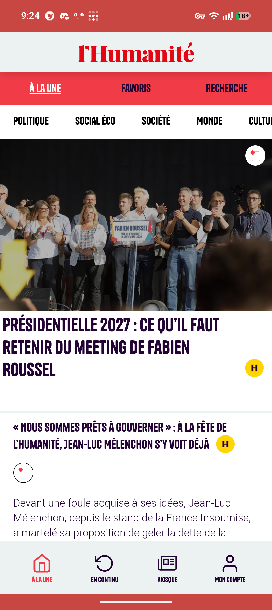

`Screenshot_20260913-092458.png` · 09:24:58

**Contenu** (de haut en bas)

- Header, puis onglets haut sur `#F13C47` : **À LA UNE** (souligné) · FAVORIS · RECHERCHE.
- Rubriques en scroll horizontal : POLITIQUE · SOCIAL ÉCO · SOCIÉTÉ · MONDE · CULTU… (coupé).
- Carte hero : photo pleine largeur, favori en haut à droite, titre Tanker aubergine sur 3 lignes, badge H.
- Carte texte seul : titre + badge H, favori, chapô coupé par la barre du bas.
- Barre du bas `#ECF2F2` : À LA UNE (actif, rouge) · EN CONTINU · KIOSQUE · MON COMPTE.

**Données d'une carte** : titre · image · premium · favori · chapô. Ni rubrique, ni auteur, ni date.

**Frictions**

- ✗ Trois niveaux de navigation empilés ; le contenu n'occupe que ≈ 66 % de la hauteur.
- ⚠ « À la une » est à la fois un onglet haut et un onglet du bas.

**En RN**

- Header qui se replie au scroll, rubriques en barre collante, swipe entre rubriques (`react-native-pager-view`).
- Recherche en icône dans le header.
- `FlashList` + `expo-image`, pull-to-refresh, favori optimiste avec retour haptique.

<br clear="all">

### 03 · En continu

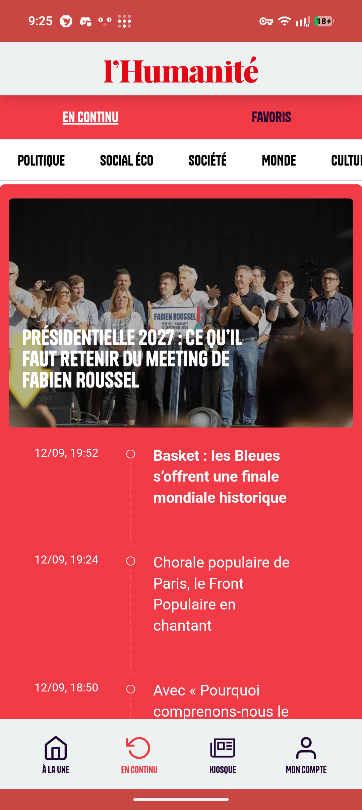

`Screenshot_20260913-092500.png` · 09:25:00

**Contenu**

- Onglets haut : **EN CONTINU** · FAVORIS (pas de RECHERCHE).
- Rubriques identiques à 02.
- Fond `#F13C47` : carte hero arrondie, titre Tanker blanc sur la photo.
- Timeline : « 12/09, 19:52 » · trait pointillé et cercle · titre blanc. Certains titres en gras (« Basket : les Bleues s'offrent une finale mondiale historique »), d'autres non (« Chorale populaire de Paris, le Front Populaire en chantant »).

**Frictions**

- ⚠ Heures absolues (« 12/09, 19:52 ») lues le 13/09 à 09:25.
- ⚠ Gras ou normal, sans légende.
- ⚠ Titre blanc sur photo : lisibilité qui dépend de l'image.

**En RN**

- `SectionList` par jour (« Aujourd'hui », « Hier »), heure relative, bandeau « N nouveaux articles ↑ », notifications push.

<br clear="all">

### 04 · Kiosque

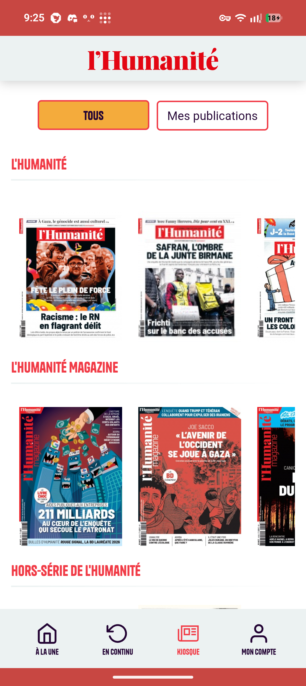

`Screenshot_20260913-092506.png` · 09:25:06

**Contenu**

- Header seul, sans onglets haut.
- Filtre : **TOUS** (fond `#F4AB3C`, Tanker) · Mes publications (contour rouge, Roboto).
- Trois sections, titre Tanker rouge + filet, carrousel horizontal de couvertures : L'HUMANITÉ · L'HUMANITÉ MAGAZINE · HORS-SÉRIE DE L'HUMANITÉ.

**Frictions**

- ⚠ Couvertures sans date, numéro ni état (acheté, téléchargé) ; vignettes floues.
- ⚠ Deux typos différentes dans un même filtre.
- ⚠ ≈ 130 px vides entre le titre de section et les couvertures.

**En RN**

- Carrousels horizontaux, date sous chaque couverture, badge « téléchargé », progression du téléchargement.
- Tap → liseuse, avec transition partagée de la couverture à la page ; lecture hors ligne.

<br clear="all">

### 05 · Mon compte

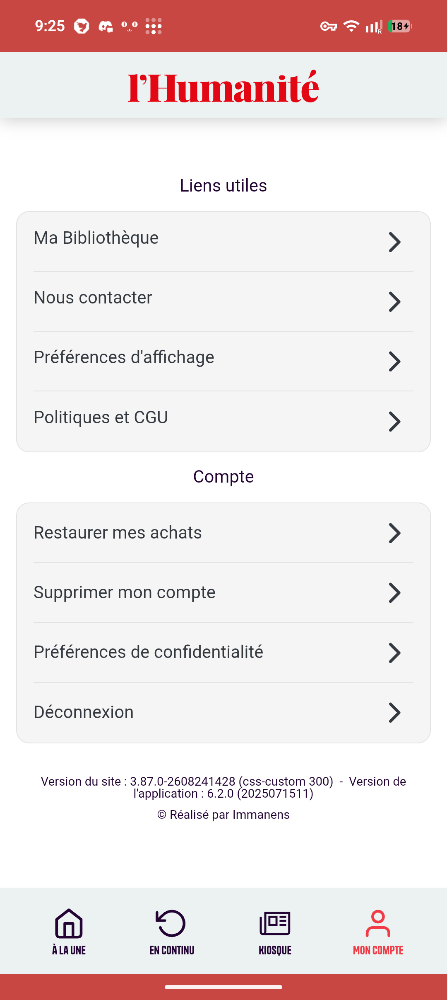

`Screenshot_20260913-092509.png` · 09:25:09

**Contenu**

- « Liens utiles » : Ma Bibliothèque · Nous contacter · Préférences d'affichage · Politiques et CGU.
- « Compte » : Restaurer mes achats · Supprimer mon compte · Préférences de confidentialité · Déconnexion.
- Listes groupées `#F5F5F5` à chevrons.
- Pied : `Version du site : 3.87.0-2608241428 (css-custom 300) - Version de l'application : 6.2.0 (2025071511)` · « © Réalisé par Immanens ».

**Frictions**

- ✗ Ni nom, ni e-mail, ni statut d'abonnement, alors qu'une session est ouverte.
- ⚠ « Supprimer mon compte » au milieu des actions courantes, dans le même style.
- ⚠ Versions techniques du site et du CSS affichées à l'utilisateur.

**En RN**

- En-tête de profil : nom, formule, échéance, « Gérer l'abonnement ».
- Zone « danger » séparée, avec confirmation ; seule la version de l'app, en discret.

<br clear="all">

### 06 · Favoris (vide)

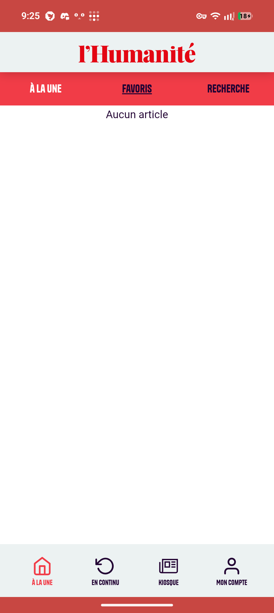

`Screenshot_20260913-092515.png` · 09:25:15

**Contenu**

- Onglets haut : À LA UNE · **FAVORIS** · RECHERCHE ; barre des rubriques masquée.
- « Aucun article », puis écran blanc.

**Frictions**

- ✗ Rien n'explique comment ajouter un favori, aucune action proposée.
- ⚠ « À LA UNE » reste blanc alors qu'il est inactif, FAVORIS (actif) est aubergine : seul le soulignement indique l'onglet courant.

**En RN**

- État vide illustré : « Touchez 🔖 sur un article pour le retrouver ici » + bouton vers À la une.
- Favoris synchronisés au compte, disponibles hors ligne, swipe pour retirer.

<br clear="all">

### 07 · Recherche — saisie

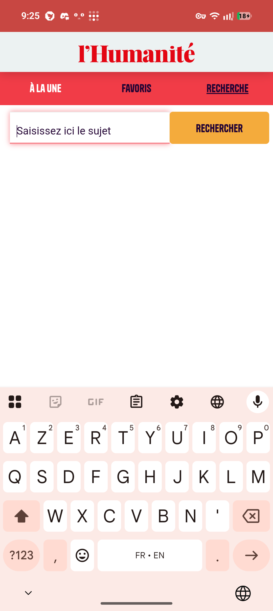

`Screenshot_20260913-092520.png` · 09:25:20

**Contenu**

- Onglet **RECHERCHE** ; champ « Saisissez ici le sujet » (focus : bordure rouge, halo rose) ; bouton RECHERCHER `#F4AB3C`.
- Clavier ouvert, touche d'action « → ».

**Frictions**

- ⚠ Écran vide sous le champ : ni historique, ni suggestions, ni rubriques.
- ⚠ Touche d'action « → » au lieu d'une loupe.

**En RN**

- Recherche instantanée (debounce), `returnKeyType="search"`, recherches récentes, rubriques et sujets suggérés.

<br clear="all">

### 08 · Recherche — chargement

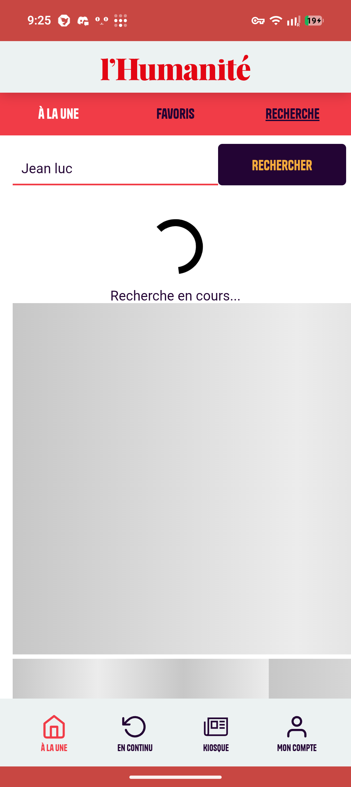

`Screenshot_20260913-092534.png` · 09:25:34

**Contenu**

- Requête « Jean luc » ; le bouton passe en aubergine `#230434`, texte orange.
- Spinner noir + « Recherche en cours... » ; skeleton gris en dessous.

**Frictions**

- ✗ Deux indicateurs de chargement en même temps.
- ⚠ Spinner noir, hors palette.

**En RN**

- Un seul état : skeleton à la forme des résultats ; les résultats précédents restent affichés pendant la frappe.

<br clear="all">

### 09 · Recherche — résultats

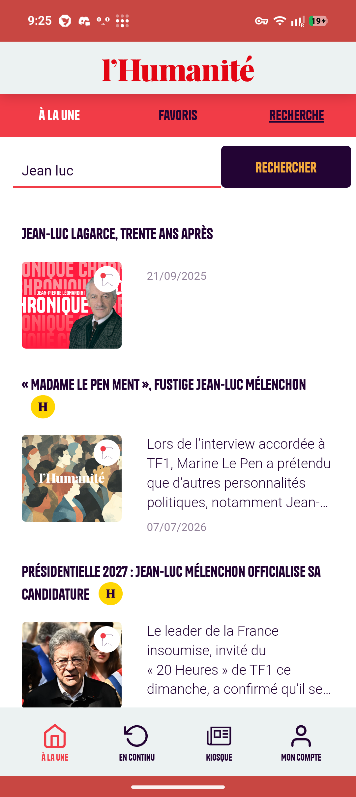

`Screenshot_20260913-092537.png` · 09:25:37

**Contenu** (par résultat)

- Titre Tanker aubergine, avec badge H le cas échéant.
- Vignette arrondie à gauche, favori en surimpression ; à droite, chapô tronqué « … » et date `jj/mm/aaaa` en `#918199`.
- Visibles : « JEAN-LUC LAGARCE, TRENTE ANS APRÈS » (21/09/2025, sans chapô) · « « MADAME LE PEN MENT », FUSTIGE JEAN-LUC MÉLENCHON » (07/07/2026, vignette générique) · « PRÉSIDENTIELLE 2027 : JEAN-LUC MÉLENCHON OFFICIALISE SA CANDIDATURE ».

**Frictions**

- ⚠ Ni nombre de résultats, ni tri, ni filtre ; un article de 2025 passe avant ceux de 2026.
- ⚠ Terme recherché non surligné.
- ⚠ Badge H seul sur sa ligne (2e résultat).

**En RN**

- Tri par pertinence ou date, filtres rubrique et période, compteur, surlignage, scroll infini.

<br clear="all">

### 10 · Préférences d'affichage

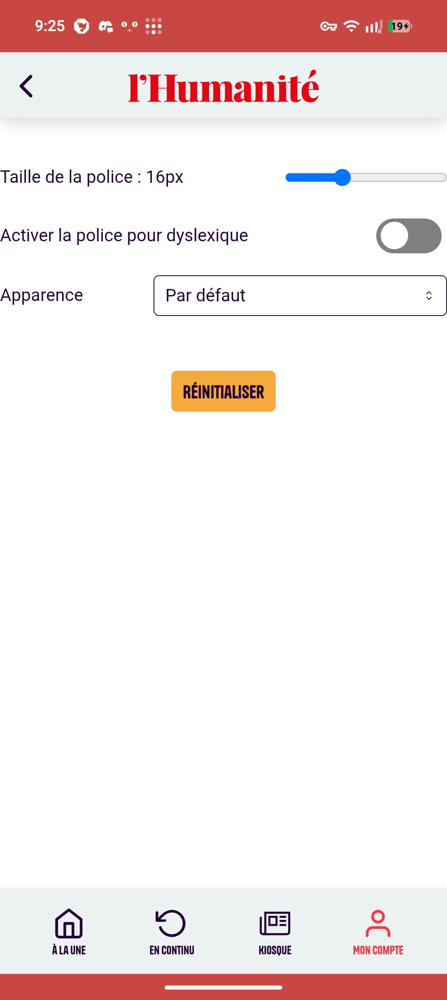

`Screenshot_20260913-092546.png` · 09:25:46 · Mon compte → Préférences d'affichage

**Contenu**

- Header avec retour ‹.
- « Taille de la police : 16px » + slider ; « Activer la police pour dyslexique » + interrupteur (désactivé) ; « Apparence » + liste « Par défaut » ; bouton RÉINITIALISER.

**Frictions**

- ✗ Contrôles du navigateur : slider bleu `#0075FF`, liste déroulante HTML.
- ✗ Libellés collés au bord gauche de l'écran, sans marge.
- ⚠ Aucun aperçu ; l'unité « px » est montrée à l'utilisateur.

**En RN**

- Aperçu en direct d'un paragraphe ; taille par crans A− / A+ ; police pour dyslexiques ; thème Système / Clair / Sombre en contrôle segmenté.

<br clear="all">

### 11 · Article vidéo — haut

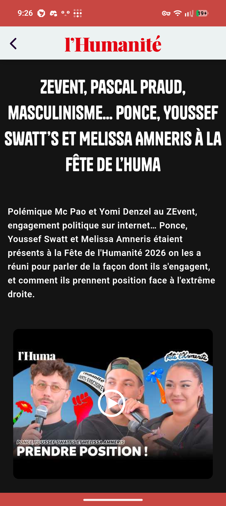

`Screenshot_20260913-092629.png` · 09:26:29

**Contenu**

- Header clair + retour ‹ ; plus de barre du bas.
- Fond `#141414` ; titre Tanker blanc centré sur 4 lignes : « ZEVENT, PASCAL PRAUD, MASCULINISME… PONCE, YOUSSEF SWATT'S ET MELISSA AMNERIS À LA FÊTE DE L'HUMA ».
- Chapô blanc ; vidéo intégrée (vignette + bouton lecture, coins arrondis).

**Frictions**

- ⚠ Barres système rouges et header clair au-dessus d'une page noire.
- ⚠ Source de la vidéo non identifiable sur la capture.

**En RN**

- Header et barres système qui suivent le thème de l'article ; lecteur natif (`expo-video`) avec plein écran si la source le permet.

<br clear="all">

### 12 · Article vidéo — bas

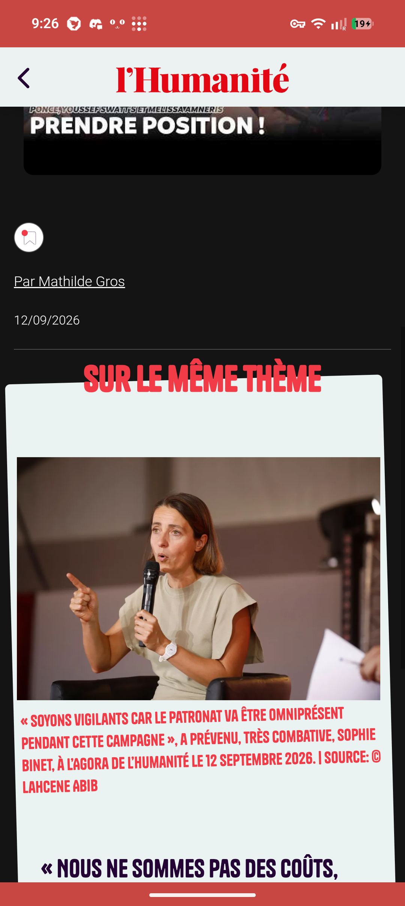

`Screenshot_20260913-092634.png` · 09:26:34

**Contenu**

- Fin de la vidéo ; favori ; « Par Mathilde Gros » (lien) ; « 12/09/2026 » ; filet.
- « SUR LE MÊME THÈME » (Tanker rouge) à cheval sur une carte `#ECF2F2` inclinée : photo, puis en Tanker rouge « « SOYONS VIGILANTS CAR LE PATRONAT VA ÊTRE OMNIPRÉSENT PENDANT CETTE CAMPAGNE », A PRÉVENU, TRÈS COMBATIVE, SOPHIE BINET, À L'AGORA DE L'HUMANITÉ LE 12 SEPTEMBRE 2026. | SOURCE: © LAHCENE ABIB », puis le titre aubergine « « NOUS NE SOMMES PAS DES COÛTS, … ».

**Frictions**

- ✗ La légende et le crédit photo s'affichent en style titre, avant le vrai titre de l'article lié.
- ⚠ Auteur et date après la vidéo ; date sans heure.
- ⚠ Grand vide dans la carte, entre l'en-tête et la photo.

**En RN**

- Byline sous le titre (auteur · date · temps de lecture) ; « Sur le même thème » en carrousel de cartes standard.

<br clear="all">

### 13 · Article texte — haut

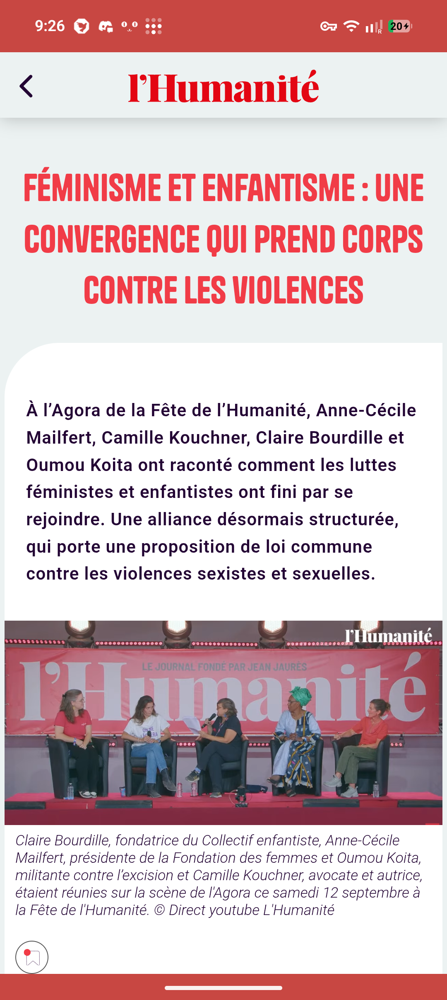

`Screenshot_20260913-092643.png` · 09:26:43

**Contenu**

- Fond `#ECF2F2`, titre Tanker `#F13C47` centré : « FÉMINISME ET ENFANTISME : UNE CONVERGENCE QUI PREND CORPS CONTRE LES VIOLENCES ».
- Feuille blanche à grand arrondi en haut à gauche ; chapô gras aubergine.
- Photo pleine largeur ; légende en italique gris, terminée par « © Direct youtube L'Humanité » ; favori.

**Frictions**

- ⚠ Seules actions visibles : retour ‹ et favori. Ni partage, ni taille du texte, ni rubrique.

**En RN**

- Barre d'actions persistante (favori, partager, taille du texte) ; rubrique au-dessus du titre ; photo zoomable.

<br clear="all">

### 14 · Article texte — corps

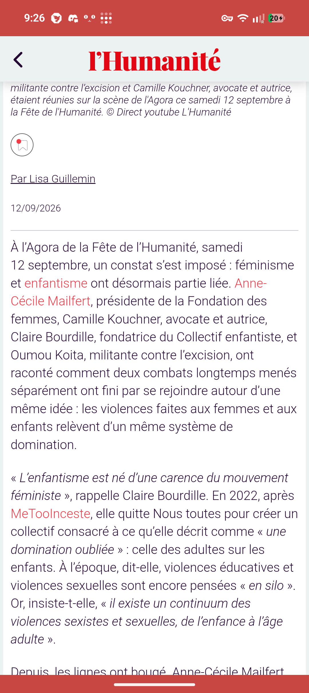

`Screenshot_20260913-092646.png` · 09:26:46

**Contenu**

- Fin de la légende ; favori ; « Par Lisa Guillemin » ; « 12/09/2026 » ; filet.
- Corps en Roboto Light aubergine ; citations en italique entre « » ; liens rouges : « enfantisme », « Anne-Cécile Mailfert », « MeTooInceste ».

**Frictions**

- ⚠ Auteur et date après le chapô et la photo, comme sur 12.
- ⚠ Destination des liens inconnue (article interne, tag, navigateur ?).

**En RN**

- Rendu natif du contenu structuré, sans WebView ; liens internes → écran natif, liens externes → navigateur in-app.

<br clear="all">

### 15 · Article texte — intertitre

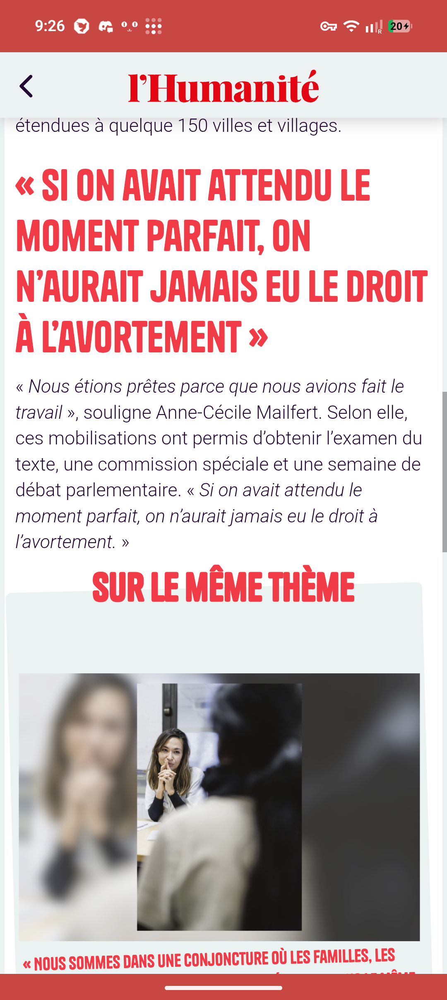

`Screenshot_20260913-092650.png` · 09:26:50

**Contenu**

- Intertitre-citation Tanker rouge sur 4 lignes : « « SI ON AVAIT ATTENDU LE MOMENT PARFAIT, ON N'AURAIT JAMAIS EU LE DROIT À L'AVORTEMENT » ».
- Paragraphe, puis bloc « SUR LE MÊME THÈME » **au milieu du texte** : photo portrait sur fond flouté, texte Tanker rouge « « NOUS SOMMES DANS UNE CONJONCTURE OÙ LES FAMILLES, LES… » (même motif que 12 ; le titre aubergine est en haut de 16).

**Frictions**

- ⚠ Bloc lié inséré dans le fil du texte : il coupe la lecture.
- ⚠ Intertitre et texte de la carte liée dans le même style (Tanker rouge, capitales) : hiérarchie ambiguë.

**En RN**

- Blocs typés (intertitre, citation, encart lié) aux styles distincts ; articles liés regroupés.

<br clear="all">

### 16 · Article texte — fin

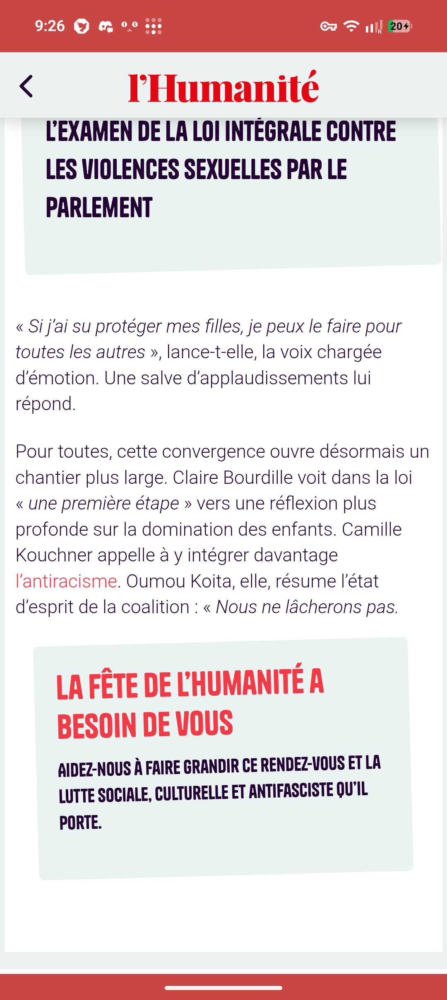

`Screenshot_20260913-092656.png` · 09:26:56

**Contenu**

- Fin de la carte liée : « L'EXAMEN DE LA LOI INTÉGRALE CONTRE LES VIOLENCES SEXUELLES PAR LE PARLEMENT ».
- Deux paragraphes, lien rouge « l'antiracisme ».
- Encart incliné : « LA FÊTE DE L'HUMANITÉ A BESOIN DE VOUS » (rouge) + « AIDEZ-NOUS À FAIRE GRANDIR CE RENDEZ-VOUS ET LA LUTTE SOCIALE, CULTURELLE ET ANTIFASCISTE QU'IL PORTE. » (aubergine).
- La feuille blanche de l'article se termine en bas de la capture (la suite n'est pas capturée).

**Frictions**

- ✗ Encart d'appel au soutien sans bouton ni lien visible.
- ⚠ Rien de visible après l'encart : ni article suivant, ni tags, ni partage.

**En RN**

- Pied d'article : partager, favori, tags, 3 à 5 articles liés, article suivant ; encart de soutien avec un vrai bouton.

<br clear="all">

### 17 · Rubrique Monde — haut

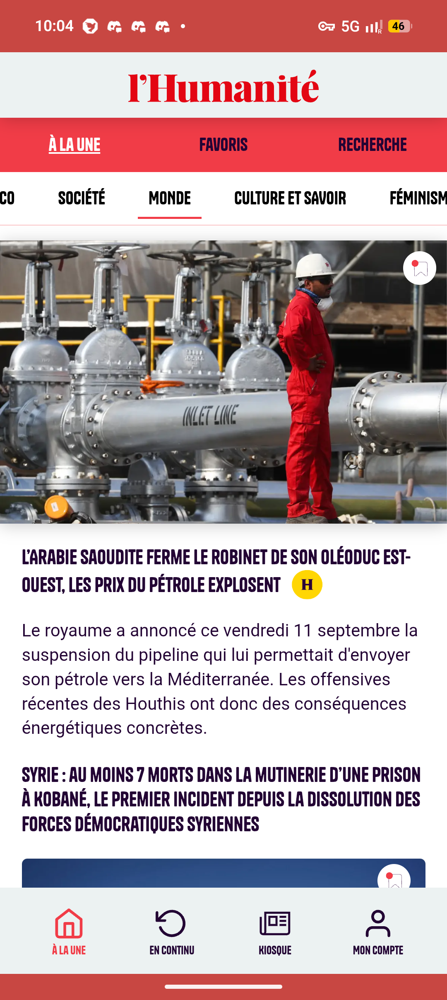

`Screenshot_20260913-100435.png` · 10:04:35 · À la une → rubrique MONDE

**Contenu**

- Onglets haut : **À LA UNE** (souligné).
- Barre des rubriques défilée : …CO · SOCIÉTÉ · **MONDE** (barre rouge sous le libellé) · CULTURE ET SAVOIR · FÉMINISM… (coupé).
- Carte hero : photo pleine largeur, favori, titre Tanker aubergine sur 2 lignes « L'ARABIE SAOUDITE FERME LE ROBINET DE SON OLÉODUC EST-OUEST, LES PRIX DU PÉTROLE EXPLOSENT » + badge H, puis chapô (« Le royaume a annoncé ce vendredi 11 septembre la suspension du pipeline… »).
- Titre suivant « SYRIE : AU MOINS 7 MORTS DANS LA MUTINERIE D'UNE PRISON À KOBANÉ, LE PREMIER INCIDENT DEPUIS LA DISSOLUTION DES FORCES DÉMOCRATIQUES SYRIENNES », puis photo arrondie (carte empilée, coupée).

**Frictions**

- ⚠ Deux états actifs imbriqués : onglet « À LA UNE » + rubrique MONDE.
- ⚠ Aucun titre de page : seule la barre défilée indique la rubrique.
- ⚠ Titre du hero plus petit que sur la une (02) : deux tailles de hero.

**En RN**

- Pager horizontal par rubrique (swipe), indicateur qui suit le doigt, nom de la rubrique dans le header replié.

<br clear="all">

### 18 · Rubrique Monde — cartes empilée et chronique

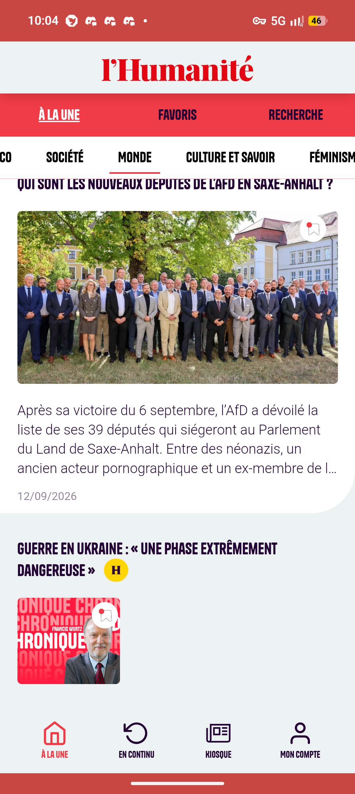

`Screenshot_20260913-100439.png` · 10:04:39

**Contenu**

- Carte empilée sur fond blanc : titre (passé sous la barre) « QUI SONT LES NOUVEAUX DÉPUTÉS DE L'AFD EN SAXE-ANHALT ? », grande photo arrondie + favori, chapô tronqué à 4 lignes, date « 12/09/2026 ».
- Le bloc blanc se termine par un grand arrondi en bas à droite ; la section suivante est sur `#ECF2F2`.
- Carte chronique : « GUERRE EN UKRAINE : « UNE PHASE EXTRÊMEMENT DANGEREUSE » » + badge H ; vignette rouge « CHRONIQUE » avec portrait et nom du chroniqueur (Francis Wurtz), favori.

**Frictions**

- ⚠ Carte chronique : moitié droite vide, ni chapô ni date.
- ⚠ Date présente sur la carte empilée, absente des cartes ligne (19).

**En RN**

- Chronique : portrait, nom du chroniqueur, chapô, date.
- Garder l'alternance blanc / brume et ses arrondis (signature visuelle).

<br clear="all">

### 19 · Rubrique Monde — cartes ligne

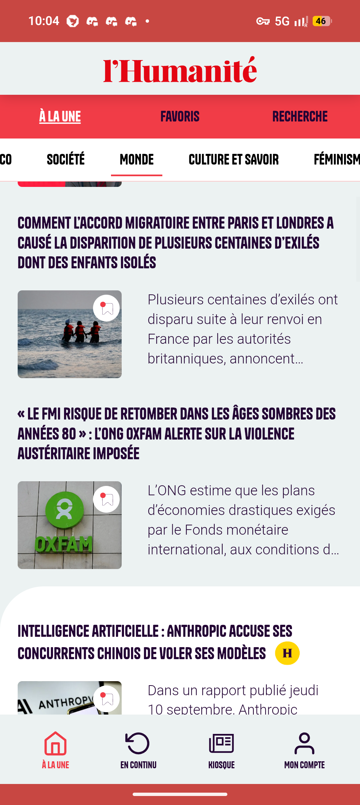

`Screenshot_20260913-100442.png` · 10:04:42

**Contenu**

- Section `#ECF2F2`, cartes ligne : titre sur toute la largeur, puis vignette arrondie à gauche (favori) et chapô tronqué à droite :
  - « COMMENT L'ACCORD MIGRATOIRE ENTRE PARIS ET LONDRES A CAUSÉ LA DISPARITION DE PLUSIEURS CENTAINES D'EXILÉS DONT DES ENFANTS ISOLÉS »
  - « « LE FMI RISQUE DE RETOMBER DANS LES ÂGES SOMBRES DES ANNÉES 80 » : L'ONG OXFAM ALERTE SUR LA VIOLENCE AUSTÉRITAIRE IMPOSÉE »
- Nouveau bloc blanc à grand arrondi en haut à gauche : « INTELLIGENCE ARTIFICIELLE : ANTHROPIC ACCUSE SES CONCURRENTS CHINOIS DE VOLER SES MODÈLES » + badge H, vignette + chapô.

**Frictions**

- ⚠ Aucune date ni rubrique sur ces cartes.

**En RN**

- Date relative et badge premium sur une ligne de métadonnées commune à toutes les variantes.

<br clear="all">

### 20 · Mon compte — déconnecté

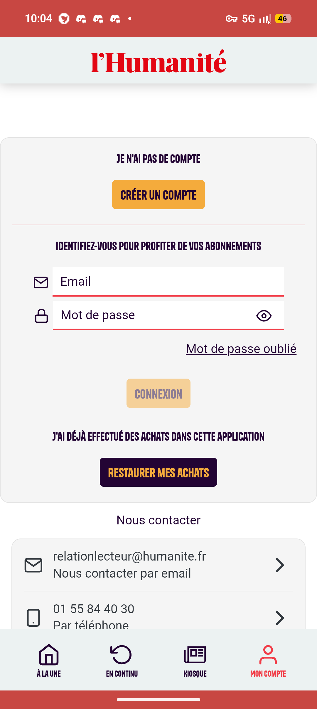

`Screenshot_20260913-100449.png` · 10:04:49

**Contenu**

- Carte grise arrondie :
  - « JE N'AI PAS DE COMPTE » + bouton **CRÉER UN COMPTE** (orange).
  - Filet rose.
  - « IDENTIFIEZ-VOUS POUR PROFITER DE VOS ABONNEMENTS » ; champs « Email » (icône enveloppe hors du champ) et « Mot de passe » (cadenas, œil pour afficher), soulignés en rouge ; lien « Mot de passe oublié ».
  - Bouton **CONNEXION** désactivé (orange pâle).
  - « J'AI DÉJÀ EFFECTUÉ DES ACHATS DANS CETTE APPLICATION » + bouton **RESTAURER MES ACHATS** (aubergine, texte orange).
- « Nous contacter » : relationlecteur@humanite.fr (par e-mail) · 01 55 84 40 30 (par téléphone).

**Frictions**

- ✗ Trois parcours dans une seule carte, avec trois styles de bouton ; l'action principale (se connecter) est la moins visible tant qu'elle est désactivée.
- ⚠ « Créer un compte » placé avant le formulaire de connexion.
- ⚠ Icônes posées hors des champs ; aucune connexion Google ou Apple visible.

**En RN**

- Écran de connexion dédié, autofill (`autoComplete="email"`, `"current-password"`), bouton principal toujours visible ; « Créer un compte » et « Restaurer mes achats » en actions secondaires.

<br clear="all">

---

## Questions ouvertes

- **Source des contenus** : l'API WordPress de humanite.fr est fermée (`/wp-json/` → 403 ; `/wp-json/wp/v2/posts` → 401 `MISSING_AUTHORIZATION_HEADER`) et l'API de l'app actuelle (Immanens) n'est pas publique. L'accès est à obtenir auprès de l'éditeur.
- **Pas de scraping par l'assistant** : `https://www.humanite.fr/robots.txt` (lu le 13/09/2026) contient `User-agent: Claude-User`, `ClaudeBot`, `anthropic-ai`… suivis de `Disallow: /`. Le mock reste fictif en attendant l'API.
- **Abonnement** : « Restaurer mes achats » (05, 20) implique des achats in-app ; le paywall des articles H n'est pas capturé. Décision du 13/09/2026 : ni auth ni achats dans la première version (session mock).
- **Écrans non capturés** : création de compte, mot de passe oublié, paywall, Ma bibliothèque, Mes publications, liseuse du kiosque, rubriques après « FÉMINISM… », partage, notifications, thème sombre.
- **En continu** (03) : que signifie un titre en gras ?
- **Tanker** : licence vérifiée le 13/09/2026 (ITF Free Font License : embarquement dans une app autorisé ; dépôt public, sous-ensemble et conversion de format interdits). Décision à consigner dans l'ADR sur la typographie.

## Méthode

- Couleurs : couleur majoritaire (Pillow) par zone, sur les PNG originaux 1080×2412.
- Polices : texte des captures comparé, à largeur égale, au rendu des `.woff` du thème humanite.fr (Tanker, Overpass) et de Roboto (google/fonts) ; score de recouvrement des glyphes.
- Site : une dizaine de requêtes le 13/09/2026, **avant** la lecture du robots.txt → `<meta name="generator" content="WordPress 6.9.7" />`, `wp-content/themes/humanite/dist/index.css`, `icon-lib.svg#gold-dot`. Aucune requête depuis ; les copies locales ont été supprimées.
